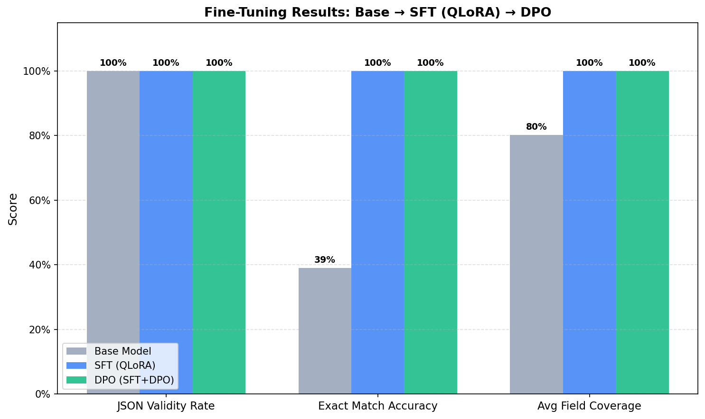

# Project 4: Fine-Tuning with LoRA & DPO
## Structured JSON Extraction — Qwen2.5-7B-Instruct

A fine-tuned language model for **structured JSON extraction from unstructured text**, 
using QLoRA for parameter-efficient supervised fine-tuning followed by DPO preference tuning.

---

## Results Summary

| Model | JSON Validity | Exact Match | Field Coverage |
|---|---|---|---|
| Base Model (Qwen2.5-7B-Instruct) | 100.0% | 39.0% | 80.2% |
| SFT Model (QLoRA fine-tuned) | 100.0% | 100.0% | 100.0% |
| DPO Model (SFT + DPO) | 100.0% | 100.0% | 100.0% |



---

## Task

**Structured JSON Extraction** — given messy, unstructured natural language text,
extract specified fields and return schema-compliant JSON. Four schema types:
person contact info, product listings, event details, and invoice data.

## Why Fine-Tune?

Even with careful prompt engineering, the base model frequently:
- Wraps JSON in markdown code fences (breaks parsers)
- Adds explanatory text before/after the JSON
- Misses or renames fields
- Returns inconsistent data types

Fine-tuning on 2,000+ task-specific examples eliminates these failure modes.

## Tech Stack

| Component | Tool |
|---|---|
| Base Model | Qwen2.5-7B-Instruct |
| Fine-Tuning | QLoRA (4-bit, rank=16) via HuggingFace TRL |
| Preference Tuning | DPO (beta=0.1) |
| GPU | Runpod A100 40GB |
| Tracking | Weights & Biases |

## Project Structure

```
00_setup.ipynb          # Environment setup & auth
01_data_prep.ipynb      # Dataset generation (SFT + DPO pairs)
02_baseline_eval.ipynb  # Base model evaluation (Row 1 of table)
03_sft_qlora.ipynb      # QLoRA fine-tuning (Row 2)
04_dpo_train.ipynb      # DPO preference tuning (Row 3)
05_final_comparison.ipynb  # This notebook — full comparison + charts
```

## What Went Wrong & How I Fixed It

> *(Fill this section in after training — this is what hiring managers want to see!)*

Examples of things to document:
- Did the model overfit early? (look for val_loss increasing while train_loss drops)
- Did it still add markdown fences sometimes? (document frequency and fix via data)
- Did boolean fields (`in_stock`) serialize inconsistently? (document and fix)
- Did DPO improve or slightly regress one metric? (explain the tradeoff)
